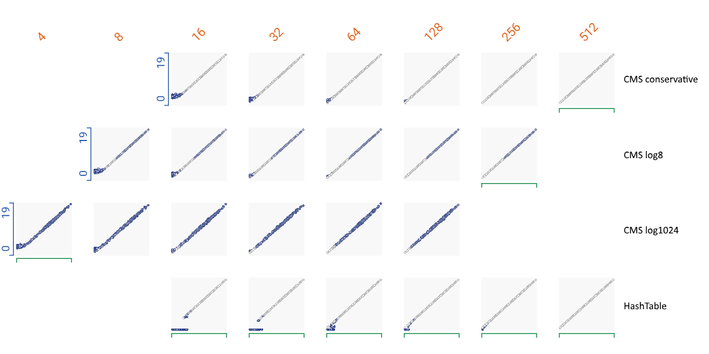

Bounded Counter – Frequency estimation for large sets
======================================================================

**Work in progress!**

Count frequencies in massive data sets using fixed memory footprint with a smart
[Count-min Sketch](https://en.wikipedia.org/wiki/Count%E2%80%93min_sketch) and HashTable implementation.

Contains implementation of Count-min Sketch table with conservative update, as well as our own implementation
using logarithmic probabilistic counter for reducing the space requirement (*log1024, log8*).
Uses an embedded [hyperloglog](https://github.com/ascv/HyperLogLog) counter to estimate the cardinality of the set of elements (how many distinct elements are tracked).

The package also contains a fast HashTable counter allocated with bounded memory which removes its low-count objects
instead of expanding.

```python
cms = CountMinSketch(size_mb=512) # Use 512 MB
print(cms.width)  # 16 777 216
print(cms.depth)   # 8
print(cms.size)  # 536 870 912 (512 MB in bytes)

cms.increment("foo")
cms.increment("bar")
cms.increment("foo")

print(cms["foo"]) # 2
print(cms["bar"]) # 1
print(cms.cardinality()) # 2
print(cms.total()) # 3
```

Parameters
----------

-   **size_mb** Maximum size of the structure in memory in megabytes.
-   **Width**: The number of columns (hash buckets) in a single row of the table. Must be a power of 2.
    Significantly affects precision and memory footprint. For precise results, this should be no smaller than one
    order of magnitude away from the cardinality of the set.
    For significantly smaller widths, deterioration will occur.
    For instance, to store all bigrams in English Wikipedia (1 857 420 106 bigrams, 179 413 989 unique),
    good results can be achieved with a width of 67 108 864 (2^26) (37%).
-   **Depth**: Number of rows, significant for the reliability of the result. Linearly affects speed of the
    algorithm as well as its memory footprint. For best results, use a small number such as 5.
    Using more than 8 is wasteful, better put that memory
    in width instead or use 'basic' or 'conservative' algorithms instead.
-   **Algorithm**: There are several algorithms available:
    -   *conservative* Count-min Sketch as described on as described on [Wikipedia](https://en.wikipedia.org/wiki/Count%E2%80%93min_sketch).
        Uses 4 bytes per cell, storing values up to 2^32 - 1
    -   *log1024* is a conservative-update probabilistic counter with a value that fits into 2 bytes. Values of this counter
        up to 2048 are precise and larger values are off by +/- 2%. The maximum value is larger than 2^71
    -   *log8* is a conservative-update probabilistic counter that fits into just 1 byte. Values of this counter
        up to 8 are precise and larger values can be off by +/- 30%. The maximum value is larger than 2^33        

Memory
------
To calculate memory footprint:
    ( width * depth * cell_size ) + HLL size

Cell size is
   - 4B for conservative algorithm
   - 2B for log1024
   - 1B for log8
   
HLL size is 64 KB

Example:
    width 2^25 (33 554 432), depth 8, logcons1024 (2B) has 2^(25 + 3 + 1) + 64 KB = 536.9 MB
    Can be pickled to disk with this exact size.

Performance
-----------
### Testing on Wikipedia set
We have counted unigrams and bigrams in English Wikipedia dataset to evaluate the counters.
In each case, we have counted the entire data set into all bounter structures:

```python
    with smart_open('title_tokens.txt.gz') as wiki:
        for lineno, line in enumerate(wiki):
            words = line.decode().split('\t')[1].split()
            counter.update(words)
```

Then, we've selected a random sample of words as a validation set (unigrams, resp. bigrams) and compared the real
count of these with the structures.
All counters use the same validation set.

#### Unigrams
The Wikipedia data set contains 7661318 distinct words in 1860927726 total words. To store all of 
these counts efficiently (but without compression), we would need approximately 160 MB (~ 22B per word).

##### Timings

| Algorithm        |        Min  |         Max |     Average |
|------------------|------------:|------------:|------------:|
| Counter          |       379s  |        379s |        379s |
| HashTable        |       293s  |        312s |        304s |
| CMS Conservative |       685s  |        703s |        698s |
| CMS log1024      |       661s  |        709s |        692s |
| CMS log8         |       630s  |        700s |        675s |


Python Counter (dict) uses approximately 800 MB to store this set in RAM.
 


#### Bigrams
The Wikipedia data set contains 179413989 distinct bigrams in 1857420106 total bigrams.
To store all of these counts efficiently (but without compression), we would need approximately 160 MB (~ 30B per word).
To store all of these counts properly, we would need approximately 5133 MB (without compression).

Storing them all in a single Python counter would require approximately 17.2 GB RAM. 

##### Timings

| Algorithm        |        Min  |         Max |     Average |
|------------------|------------:|------------:|------------:|
| Counter          |         N/A |         N/A |         N/A |
| HashTable        |       717s  |        945s |        811s |
| CMS Conservative |      1028s  |       1118s |       1088s |
| CMS log1024      |      1013s  |       1294s |       1096s |
| CMS log8         |      1001s  |       1219s |       1103s |


We used words collocations to distinguish phrases using our collected data. As a reference,
we calculated whether bigram is a phrase using reference exact counts on a set of 2000 randomly
chosen sample bigrams. Then we used value from our counter to determine whether the same bigram is a phrase,
and calculated precision, recall, and F1 value for correctly characterizing phrases according to
 reference. The following table shows the F1 values for each counter: 

Algorithm | 64 MB | 128 MB | 256 MB | 512 MB | 1024 MB | 2048 MB | 4096 MB | 8192 MB
----------|-------|--------|--------|--------|---------|---------|---------|--------
bi_cms_conservative |  |  | 0.820 | 0.993 | 0.998 | 1 | 1 | 1
bi_cms_log1024 |  | 0.818 | 0.987 | 0.993 | 1 | 0.995 | 0.998 | 
bi_cms_log8 | 0.784 | 0.960 | 0.969 | 0.969 | 0.975 | 0.974 |  | 
bi_hashtable |  | 0.917 | 0.952 | 0.978 | 0.996 | 1 | 1 |  
